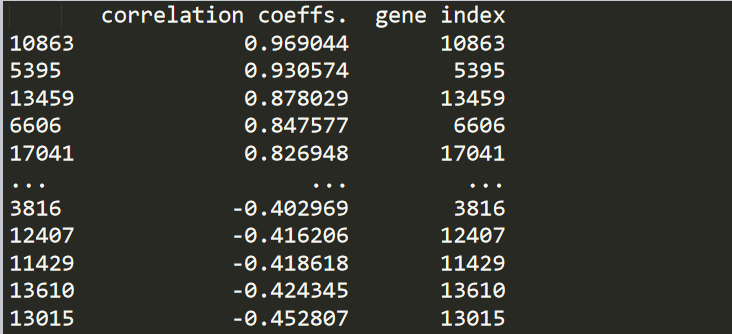
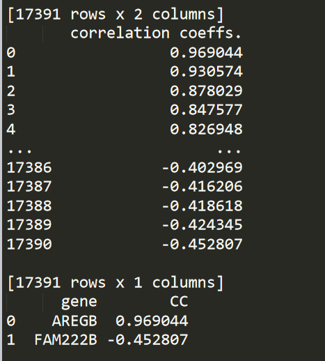
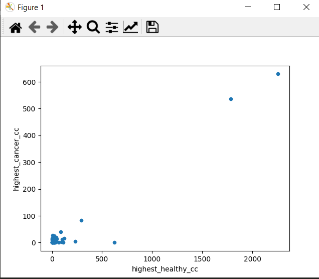
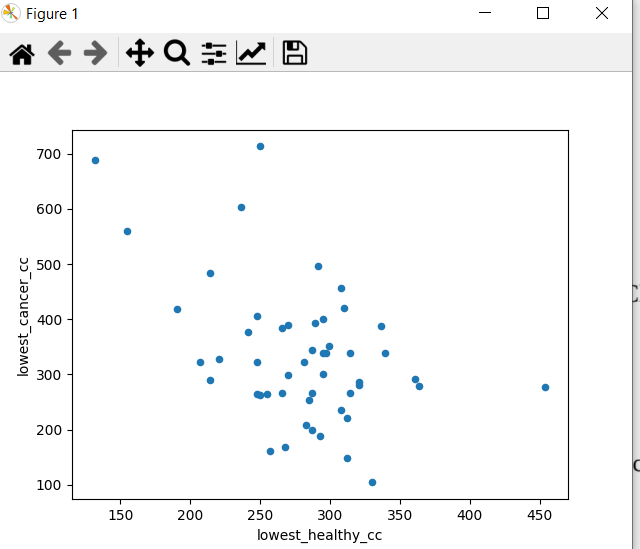
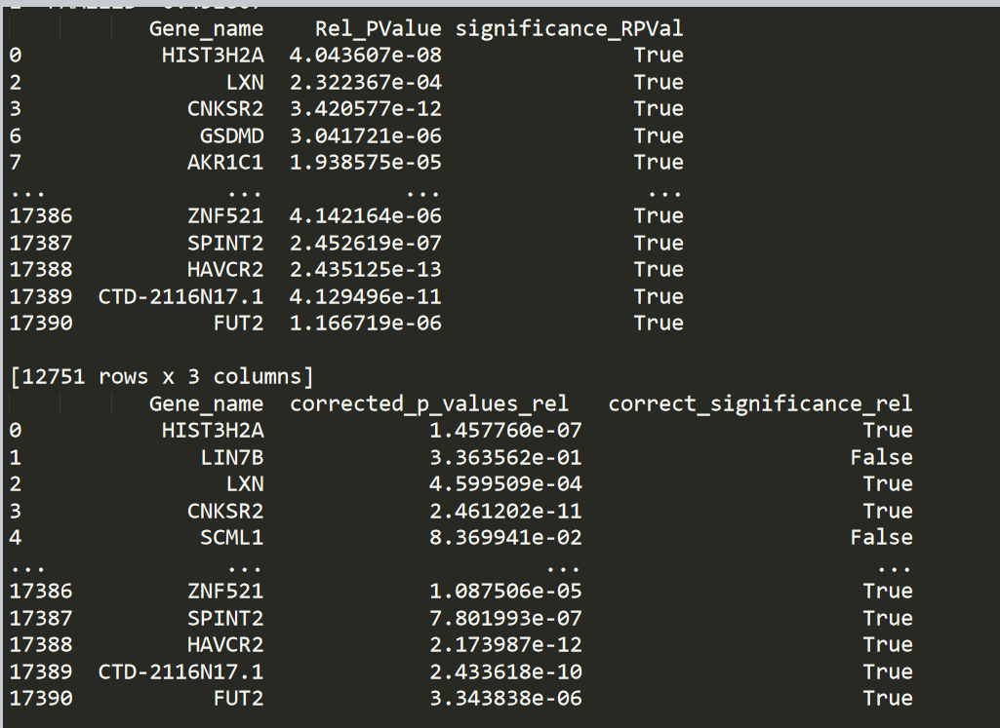
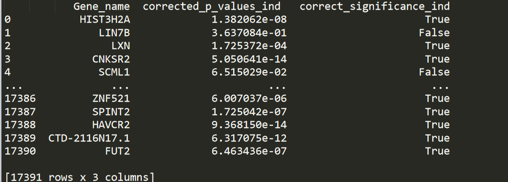
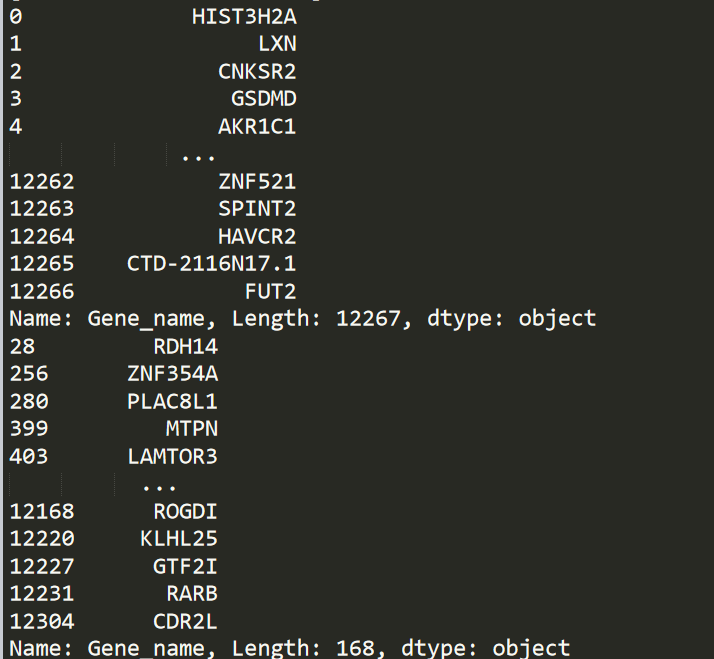
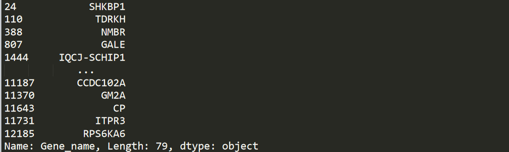

# Gene-Expression-Analysis
## Analysis of gene expression (GE) data for the cancer type Lung Squamous Cell Carcinoma (LUSC)

## Steps 
### a)Correlation
Computing the correlation between the normal samples and the diseased samples for
each gene.
### Results 
Correlation coeffients.

 

Ranked genes based on their correlation coefficient and the highest positive CC and the lowest negative CC and the names of these two genes.

  

 Plotting gene expressions for these 2 genes.
  
  
 
  

### a)Hypothesis testing
Infer the differentially expressed genes (DEGs); the genes whose
expression level differ from one condition (healthy) to another (diseased).
### Results
Applying t_test and computing  p_values and level of significance for two cases paired and independent samples. 

Applying FDR correction for both cases.

  

  

 Compare the two DEGs sets (paired and independent) after the FDR correction common ,distinct paired and distinct independent 

  

  

